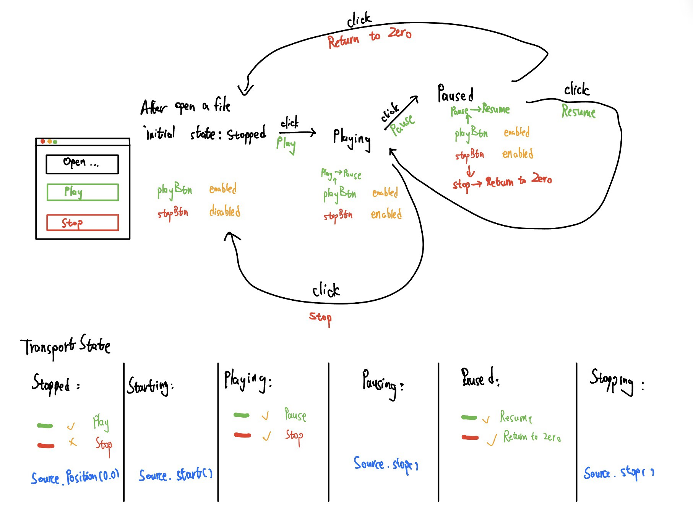

# Audio Player

---

## Finite State Machine (FSM)

> Three Core Elements:
> - States
> - Events/Triggers
> - Transitions

In this case, we use a enum class to indicate the states of music audio player

- Starting
- Playing
- Pausing
- Paused
- Stopping
- Stopped

```C++
enum class TransportState{
    Starting,
    Playing,
    Pausing,
    Paused,
    Stopping,
    Stopped
};
```

Execution process(simplified version):



## changeListenerCallBack

Timer  

TransportSource  

Thumbnail  
